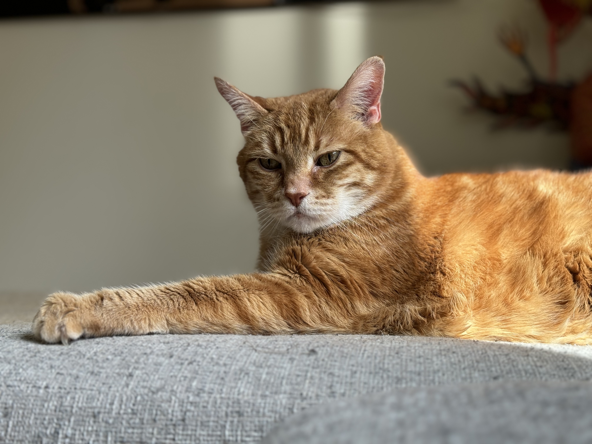
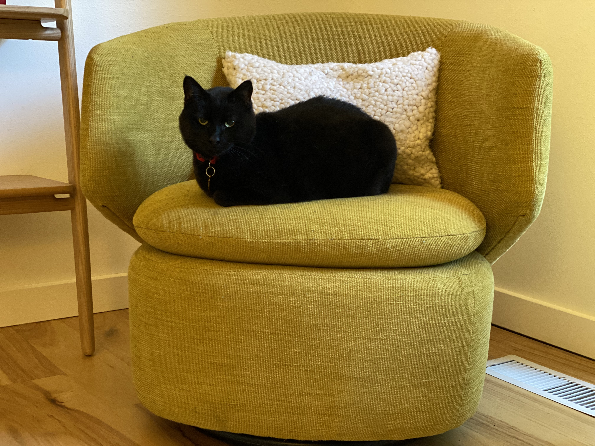
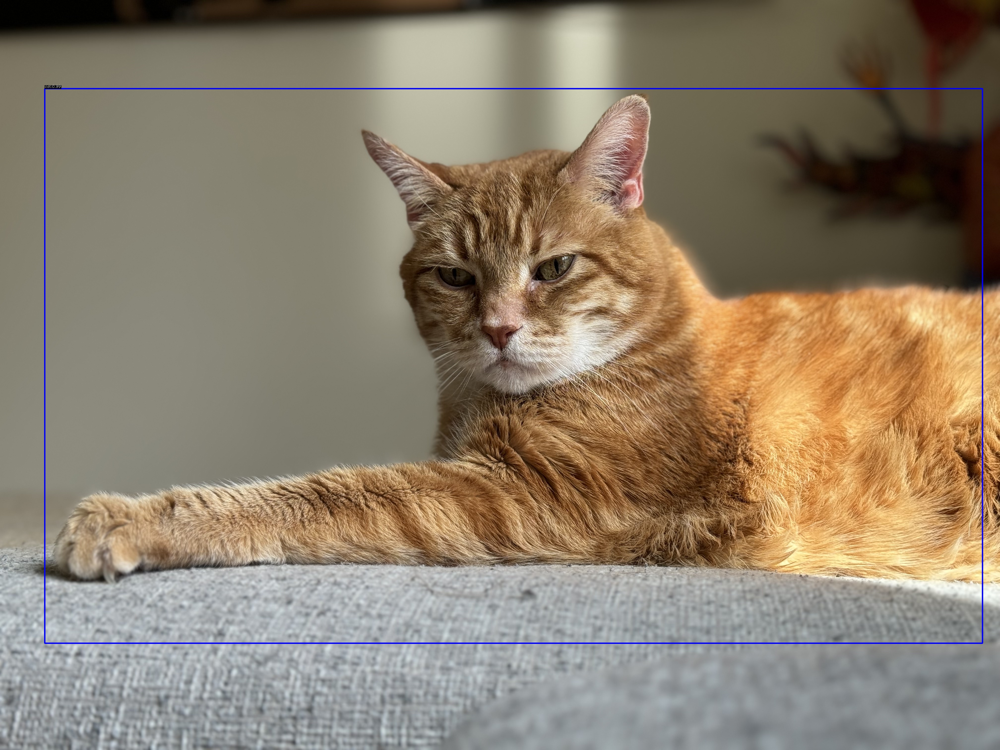

# cat-detector

Detect a tabby cat or the cat breed using PyTorch.

We have two indoor cats in our household. Beastie is an American Shorthair with orange and white tabby pattern:


Mac is a pure black American Shorthair:


They each have their own space, in addition to many shared spaces across the house. Beastie has a sneaky habit of going into Mac's space sometimes, which creates tension between them and has resulted in spraying a few times. To help prevent, I'd like to detect when Beastie is in a room he shouldn't be in. However, Mac is allowed. The goal is to notify when a tabby is detected only from security camera frames.

For now I'm just working on the image detection piece using jpg images. This is just an excuse to explore and play with deep learning models for object detection using pytorch and different libraries across Python and Go.

  - [Setup Virtual Python Environment](#setup-virtual-python-environment)
  - [Activate python-env](#activate-python-env)
  - [Install Dependencies](#install-dependencies)
  - [Converting Images to JPEG](#converting-images-to-jpeg)
  - [gocv](#gocv)
  - [Training Custom Model](#training-custom-model)
  - [Running Cat Detection](#running-cat-detection)


## Setup Virtual Python Environment

Install dependencies and create python environment for this repo:
```

mkdir models
brew install pyenv
pyenv versions
git clone https://github.com/pyenv/pyenv.git ~/.pyenv
pyenv versions
pyenv global system
python3 -m venv python-env
```

## Activate python-env

Activate the python-env before doing setup or running script::
```
source python-env/bin/activate
```

## Install Dependencies

Install python certificates for os version:
```
cd /Applications/Python\ 3.11/
bash Install\ Certificates.command
```

Install python dependencies with pip:
```
pip install opencv-python numpy==1.26.4 torch torchvision imgbeddings huggingface_hub==0.24 tflite-support psycopg2
```

## Converting Images to JPEG

Many of the images I had from my iphone were in heic format. To convert them to jpeg format, I used sips tool that's available by default on OSX:
```
for image in data/tmp/IMG*.{HEIC,heic}; do sips -s format jpeg $image --out ${image%%.*}.jpg; done
```

## gocv

Install gocv and opencv 4.10.0 dependencies:
```
mkdir ~/git/github.com/hybridgroup
cd ~/git/github.com/hybridgroup/
git clone https://github.com/hybridgroup/gocv.git
cd gocv
make install
```


The [opencv github repo](https://github.com/opencv/opencv/tree/master/data/haarcascades) includes haarcascades trained classifiers for detecting objects of particular types:
```
mkdir ~/git/github.com/opencv
cd ~/git/github.com/opencv/
git clone https://github.com/opencv/opencv.git
ls -l ~/git/github.com/opencv/opencv/data/haarcascades/haarcascade_frontalcatface.xml
```

## Training Custom Model

High level steps used to train custom model:
 - Download the images.tar.gz data set for cats and associated annotations.tar.gz from https://www.robots.ox.ac.uk/~vgg/data/pets/
 - mkdir -p data/{train,val} && cd data && tar -xzf {images,annotations}.tar.gz
 - Removed the dog images: `rm -f data/images/[a-z]*.jpg`
 - Use cat_detector.go to preprocess the images and detect cat with bounding box: `go run cat_detector.go -i data/images`
 - Move bounding box images into data/train/
 - Add my own set of tabby cat detected images into data/train/
 - Copy some of the original images (no bounding box) across breeds from data/images/ into data/val/
 - Add my own set of tabby cat validation images without bounding box into data/val
 - Run cat_breed_train.py to train custom model


Evolved to use parent directory for the label to attach to photos. Created data/{train,val}/tabby_vs_no_tabby parent folder to house sub directories that will make up each photo category. Each subdirectory created under data/{train,val}/tabby_vs_no_tabby is used to automatically label the photos within it for the model. So the photo should should represent directory name in some way and be organized along that type boundry. For tabby cat vs not I created `data/{train,val}/tabby_vs_no_tabby/tabby` and `data/{train,val}/tabby_vs_no_tabby/no_tabby`. Then photos of cats that had a tabby pattern were placed in data/{train,val}/tabby_vs_no_tabby/tabby and those without tabby pattern were placed in data/{train,val}/tabby_vs_no_tabby/no_tabby. Make sure to differ the sets of pictures in train folder vs val and don't duplicate between them. The photos in train sub dirs should include bounding boxes around the object to train on (tabby cat in this case), but the photos in the val sub directories shouldn't include bounding box.

Example of the directory structure for tabby vs no tabby:
```
(python-env) bryant@debian:~/git/github.com/brybry192/cat-detector$ ls -lhtr data/{train,val}/tabby_cat/
data/train/tabby_cat/:
total 160K
drwxr-xr-x 2 bryant bryant  12K Oct 29 13:14 tabby_cat
drwxr-xr-x 2 bryant bryant 132K Oct 29 16:18 cat
drwxr-xr-x 2 bryant bryant  16K Oct 29 16:31 no_cat

data/val/tabby_cat/:
total 28K
drwxr-xr-x 2 bryant bryant  12K Oct 29 13:17 tabby_cat
drwxr-xr-x 2 bryant bryant  12K Oct 29 13:43 cat
drwxr-xr-x 2 bryant bryant 4.0K Oct 29 16:31 no_cat
```

Use `go run cat_detector.go -i images/` to generate new images in the same directory with a bounding box drawn around the detected cat. Here's an example using images/IMG_9326_beastie.jpg
```
(python-env) bryant@debian:~/git/github.com/brybry192/cat-detector$ go run cat_detector.go -i images/IMG_9326_beastie.jpg
Processing: images/IMG_9326_beastie.jpg
Box 1 detected class ID 15 for cat at (180,357)-(3961,2593) with confidence 0.99073535
```

That generates images/IMG_9326_beastie_detected.jpg, which includes a blue bounded box around where the cat was detected in the image.:



Example training run for tabby vs cat vs no cat detection:
```
(python-env) bryant@debian:~/git/github.com/brybry192/cat-detector$ ./cat_breed_train.py --train_dir data/train/tabby_cat/ --val_dir data/val/tabby_cat/ --save_model_weights models/tabby_cat_resnet50.pth
class_names = ['cat', 'no_cat', 'tabby_cat']
Class Distribution: Counter({'cat': 2069, 'no_cat': 242, 'tabby_cat': 193})
class_names = ['cat', 'no_cat', 'tabby_cat']
Class Distribution: Counter({'cat': 190, 'tabby_cat': 154, 'no_cat': 61})
Starting training on cuda:0

Epoch    Duration (s)	Phase    Loss     Accuracy
------------------------------------------------------------
1/10     66.71       	train    0.4305   0.8542
1/10     12.38       	val      0.5765   0.7531
2/10     65.83       	train    0.1767   0.9481
2/10     11.99       	val      0.4054   0.8593
3/10     65.88       	train    0.1015   0.9685
3/10     12.62       	val      0.3649   0.8617
4/10     66.35       	train    0.0844   0.9760
4/10     12.30       	val      0.3121   0.8914
5/10     66.63       	train    0.0548   0.9856
5/10     12.54       	val      0.2789   0.9086
6/10     66.49       	train    0.0512   0.9808
6/10     12.45       	val      0.2612   0.9235
7/10     66.36       	train    0.0433   0.9872
7/10     12.93       	val      0.3244   0.8840
8/10     66.47       	train    0.0291   0.9908
8/10     12.18       	val      0.3527   0.8914
9/10     66.31       	train    0.0281   0.9928
9/10     12.27       	val      0.2664   0.9358
10/10    66.34       	train    0.0270   0.9952
10/10    12.69       	val      0.3158   0.8914

Training complete in 787.71 seconds
Model saved as models/tabby_cat_resnet50.pth
```

Example training run for cat breed detection:
```
(python-env) bryant@debian:~/git/github.com/brybry192/cat-detector$ ./cat_breed_train.py --train_dir data/train/cat_breed_classification/ --val_dir data/val/cat_breed_classification/ --save_model_weights models/cat_breed_classification_resnet50.pth --epochs 20
class_names = ['Abyssinian', 'American_Shorthair', 'Bengal', 'Bombay', 'British_Shorthair', 'Exotic_Shorthair', 'Maine_Coon', 'No_Cat', 'Persian', 'Ragdoll', 'Russian_Blue', 'Scottish_Fold', 'Siamese', 'Sphynx']
Class Distribution: Counter({'No_Cat': 1051, 'British_Shorthair': 293, 'American_Shorthair': 261, 'Bombay': 166, 'Persian': 166, 'Abyssinian': 165, 'Sphynx': 164, 'Maine_Coon': 164, 'Russian_Blue': 163, 'Siamese': 163, 'Ragdoll': 163, 'Bengal': 162, 'Scottish_Fold': 136, 'Exotic_Shorthair': 126})
class_names = ['Abyssinian', 'American_Shorthair', 'Bengal', 'Bombay', 'British_Shorthair', 'Exotic_Shorthair', 'Maine_Coon', 'No_Cat', 'Persian', 'Ragdoll', 'Russian_Blue', 'Scottish_Fold', 'Siamese', 'Sphynx']
Class Distribution: Counter({'No_Cat': 509, 'American_Shorthair': 100, 'British_Shorthair': 92, 'Exotic_Shorthair': 79, 'Scottish_Fold': 59, 'Bengal': 38, 'Russian_Blue': 37, 'Siamese': 37, 'Ragdoll': 37, 'Sphynx': 36, 'Maine_Coon': 36, 'Bombay': 34, 'Persian': 34, 'Abyssinian': 33})
Starting training on cuda:0

Epoch    Duration (s)	Phase    Loss     Accuracy
------------------------------------------------------------
1/20     74.94       	train    1.6596   0.5010
1/20     14.08       	val      0.8290   0.7321
2/20     75.18       	train    0.6692   0.8145
2/20     14.02       	val      0.4697   0.8475
3/20     75.19       	train    0.4201   0.8678
3/20     14.06       	val      0.3469   0.8958
4/20     74.89       	train    0.3169   0.8971
4/20     14.33       	val      0.3329   0.8837
5/20     74.86       	train    0.2420   0.9219
5/20     14.07       	val      0.3248   0.8966
6/20     75.10       	train    0.1980   0.9393
6/20     14.11       	val      0.3295   0.8958
7/20     74.88       	train    0.1707   0.9441
7/20     13.95       	val      0.2835   0.9165
8/20     75.49       	train    0.1479   0.9581
8/20     14.01       	val      0.3145   0.9009
9/20     74.25       	train    0.1314   0.9602
9/20     13.97       	val      0.2823   0.9190
10/20    74.74       	train    0.1127   0.9626
10/20    13.97       	val      0.3150   0.9001
11/20    74.44       	train    0.1068   0.9665
11/20    14.22       	val      0.3052   0.9078
12/20    74.53       	train    0.0903   0.9710
12/20    13.98       	val      0.3012   0.9078
13/20    74.73       	train    0.0793   0.9758
13/20    14.07       	val      0.3273   0.9061
14/20    75.13       	train    0.0649   0.9812
14/20    14.26       	val      0.2683   0.9216
15/20    74.32       	train    0.0669   0.9773
15/20    13.91       	val      0.2902   0.9190
16/20    74.59       	train    0.0661   0.9824
16/20    14.35       	val      0.3263   0.9061
17/20    74.26       	train    0.0503   0.9853
17/20    13.94       	val      0.3018   0.9078
18/20    74.31       	train    0.0441   0.9898
18/20    14.11       	val      0.2808   0.9121
19/20    74.61       	train    0.0477   0.9871
19/20    13.91       	val      0.3249   0.9018
20/20    74.61       	train    0.0394   0.9901
20/20    14.17       	val      0.2908   0.9104

Training complete in 1776.54 seconds
Model saved as models/cat_breed_classification_resnet50.pth
```

## Running Cat Detection

Running tabby_detection.py:
```

(python-env) bryant@debian:~/git/github.com/brybry192/cat-detector$ ./tabby_detector.py --model_path models/tabby_cat_resnet50.pth images/
no_cat detected in images/english_setter_31.jpg with probability 1.00
tabby_cat detected in images/IMG_0359.jpg with probability 1.00
cat detected in images/Plants_IMG_3447_detected.jpg with probability 0.49
tabby_cat detected in images/IMG_0359_beastie_detected.jpg with probability 1.00
tabby_cat detected in images/IMG_0359_detected.jpg with probability 1.00
no_cat detected in images/scottish_terrier_183.jpg with probability 0.99
no_cat detected in images/Beach_IMG_0699_detected.jpg with probability 1.00
tabby_cat detected in images/IMG_0718_detected.jpg with probability 1.00
tabby_cat detected in images/IMG_0359_beastie.jpg with probability 1.00
no_cat detected in images/keeshond_134.jpg with probability 1.00
tabby_cat detected in images/IMG_0366_beastie-cropped-0.jpg with probability 0.64
no_cat detected in images/newfoundland_1.jpg with probability 1.00
tabby_cat detected in images/IMG_9326_beastie_detected.jpg with probability 1.00
cat detected in images/IMG_3616_mac.jpg with probability 0.83
no_cat detected in images/Blue_heron_IMG_0738_detected.jpg with probability 0.73
no_cat detected in images/yorkshire_terrier_14.jpg with probability 0.95
tabby_cat detected in images/IMG_0366_beastie_detected.jpg with probability 1.00
no_cat detected in images/pug_107.jpg with probability 1.00
no_cat detected in images/Beach_IMG_0704.jpg with probability 0.99
tabby_cat detected in images/IMG_0718.jpg with probability 1.00
tabby_cat detected in images/IMG_9326_beastie.jpg with probability 1.00
no_cat detected in images/english_cocker_spaniel_18.jpg with probability 1.00
no_cat detected in images/great_pyrenees_143.jpg with probability 1.00
no_cat detected in images/Beach_IMG_0704_detected.jpg with probability 0.99
no_cat detected in images/Plants_IMG_3447.jpg with probability 0.57
no_cat detected in images/Beach_IMG_0699.jpg with probability 1.00
tabby_cat detected in images/IMG_0366_beastie.jpg with probability 1.00
no_cat detected in images/Blue_heron_IMG_0738.jpg with probability 0.70
no_cat detected in images/wheaten_terrier_111.jpg with probability 0.99
```


Using `./cat_breed_detector.py` with the default model at `./models/cat_breed_classification_resnet50.pth` on some test images to see the results:
```
(python-env) bryant@debian:~/git/github.com/brybry192/cat-detector$ ls -lhtr models/cat_breed_classification_resnet50.pth
-rw-r--r-- 1 bryant bryant 91M Oct 29 17:27 models/cat_breed_classification_resnet50.pth

(python-env) bryant@debian:~/git/github.com/brybry192/cat-detector$ ./cat_breed_detector.py
usage: cat_breed_detector.py [-h] [--confidence CONFIDENCE] [--model_path MODEL_PATH] input_path
cat_breed_detector.py: error: the following arguments are required: input_path

(python-env) bryant@debian:~/git/github.com/brybry192/cat-detector$ ./cat_breed_detector.py images/
No_Cat detected in images/english_setter_31.jpg with probability 1.00
American_Shorthair detected in images/IMG_0359.jpg with probability 1.00
No_Cat detected in images/Plants_IMG_3447_detected.jpg with probability 0.98
American_Shorthair detected in images/IMG_0359_beastie_detected.jpg with probability 1.00
American_Shorthair detected in images/IMG_0359_detected.jpg with probability 1.00
No_Cat detected in images/scottish_terrier_183.jpg with probability 1.00
No_Cat detected in images/Beach_IMG_0699_detected.jpg with probability 1.00
American_Shorthair detected in images/IMG_0718_detected.jpg with probability 1.00
American_Shorthair detected in images/IMG_0359_beastie.jpg with probability 1.00
No_Cat detected in images/keeshond_134.jpg with probability 1.00
American_Shorthair detected in images/IMG_0366_beastie-cropped-0.jpg with probability 0.96
No_Cat detected in images/newfoundland_1.jpg with probability 1.00
American_Shorthair detected in images/IMG_9326_beastie_detected.jpg with probability 1.00
Bombay detected in images/IMG_3616_mac.jpg with probability 0.94
No_Cat detected in images/Blue_heron_IMG_0738_detected.jpg with probability 0.78
No_Cat detected in images/yorkshire_terrier_14.jpg with probability 1.00
American_Shorthair detected in images/IMG_0366_beastie_detected.jpg with probability 0.99
No_Cat detected in images/pug_107.jpg with probability 1.00
No_Cat detected in images/Beach_IMG_0704.jpg with probability 1.00
American_Shorthair detected in images/IMG_0718.jpg with probability 1.00
American_Shorthair detected in images/IMG_9326_beastie.jpg with probability 1.00
No_Cat detected in images/english_cocker_spaniel_18.jpg with probability 1.00
No_Cat detected in images/great_pyrenees_143.jpg with probability 1.00
No_Cat detected in images/Beach_IMG_0704_detected.jpg with probability 1.00
No_Cat detected in images/Plants_IMG_3447.jpg with probability 0.97
No_Cat detected in images/Beach_IMG_0699.jpg with probability 1.00
American_Shorthair detected in images/IMG_0366_beastie.jpg with probability 1.00
No_Cat detected in images/Blue_heron_IMG_0738.jpg with probability 0.88
No_Cat detected in images/wheaten_terrier_111.jpg with probability 1.00
No_Cat detected in images/shiba_inu_186.jpg with probability 1.00
```
